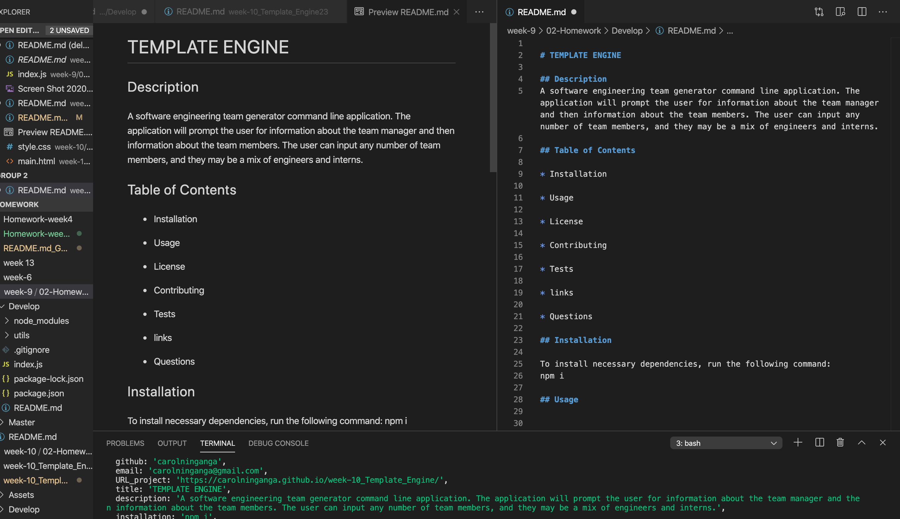

# GENERATE README

## Description
This is a command-line application that dynamically generates a README.md from a user's input. The user is prompted for their Github URL which calls Github API to retrieve their email and profile image. This is followed by questions about their project.

## Table of Contents

* Installation

* Usage

* License

* Contributing

* Tests

* links

* Questions

## Installation

To install necessary dependencies, run the following command:
npm i, node index.js

## Usage
Installation of dependecies such as axios, dotenv, and inquirer

## Contributing 
Caroline Ninganga 

## License

## Link to project URL
https://carolninganga.github.io/README.md_Generator/

## Tests

for the tests to run in the application use the following command:
npm test

## Questions

For questions about the project contact carolninganga or directly at carolninganga@gmail.com.
